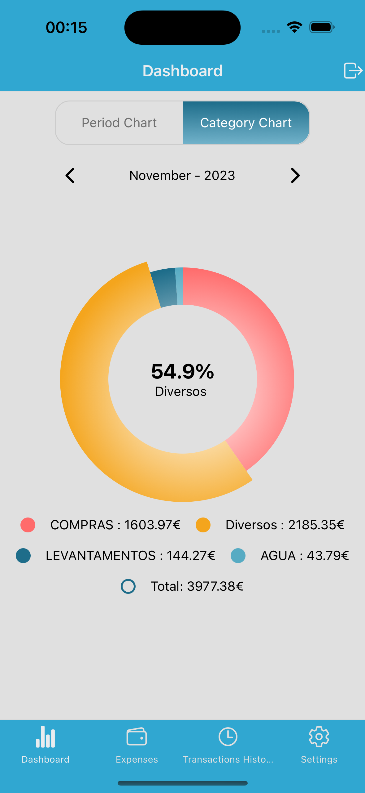
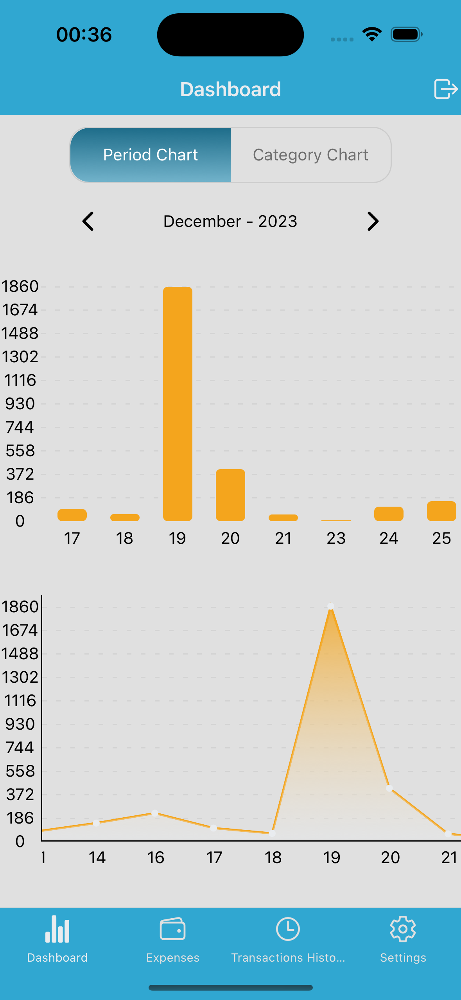
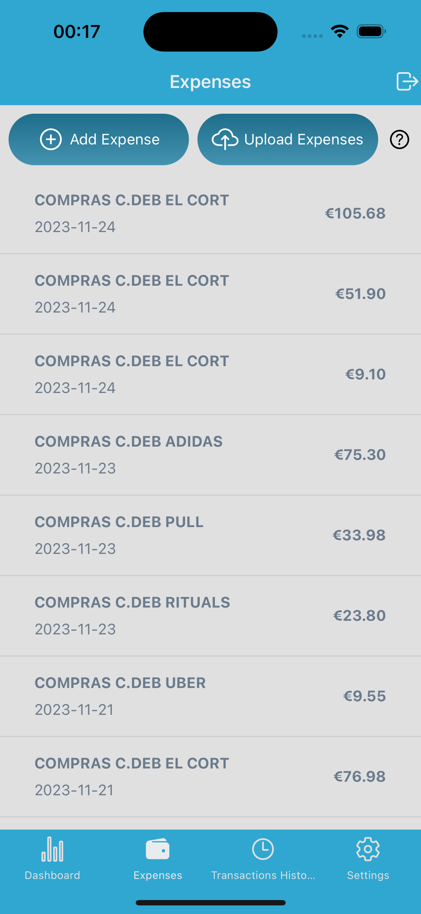
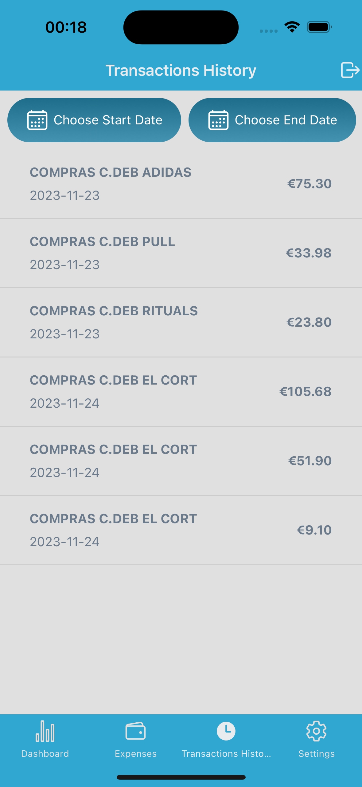
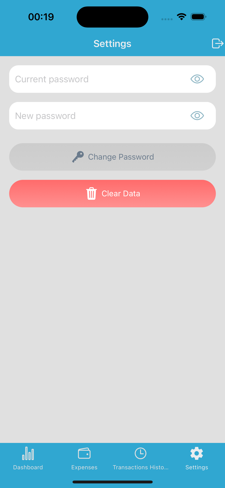

# SpentBuddy

SpentBuddy is a finance tracking app built with React Native and Expo, designed to help users manage their expenses efficiently. It features a user-friendly dashboard with insightful charts, manual and CSV expense entry, a detailed transaction history, and customizable settings.

## Features

- **Dashboard**: Visualize your spending through charts for a clear overview of your finances.
- **Expenses**: Add expenses manually or by uploading a CSV file to easily track your spending.
- **Transaction History**: View a detailed log of all your transactions to monitor your financial activity.
- **Settings**: Customize the app settings to tailor the experience to your needs.
- **Mock Data Ready**: Includes importable mock CSV files for fast local testing.

## Screenshots

### Dashboard

<div>
  
  
</div>

### Expenses and Transaction History

<div>
  
  
</div>

### Settings



## Getting Started

These instructions will guide you through setting up the project on your local machine for development and testing purposes.

### Prerequisites

Ensure you have the following software installed on your system:

- Node.js
- npm (comes with Node.js) or Yarn (install via `npm install -g yarn`)
- Expo CLI (`npm install -g expo-cli`)

### Installation

Follow these steps to get your development environment up and running:

1. **Clone the repository**

```
git clone https://github.com/KaryRabbit/spent-expo-app.git
```

1. **Install dependencies**

Navigate to the project directory and install the required dependencies:

```
npm install
```

1. **Set up environment variables**

Create a `.env` file in the root of your project directory. Add the following lines to the file, replacing the dummy values with your actual Firebase project configuration:

```
REACT_APP_FIREBASE_API_KEY=your_firebase_api_key_here
REACT_APP_FIREBASE_AUTH_DOMAIN=your_firebase_auth_domain_here
REACT_APP_FIREBASE_PROJECT_ID=your_firebase_project_id_here
REACT_APP_FIREBASE_STORAGE_BUCKET=your_firebase_storage_bucket_here
REACT_APP_FIREBASE_MESSAGING_SENDER_ID=your_firebase_messaging_sender_id_here
REACT_APP_FIREBASE_APP_ID=your_firebase_app_id_here
```

1. **Start the project with Expo**

```
npx expo start
```

## CSV Import Format

Use the **Upload Expenses** action in the Expenses screen.

Expected CSV header:

```
amount,category,description,date
```

Example row:

```
12.40,Food,Coffee,2026-02-03
```

Notes:

- `amount` should be numeric (decimal supported).
- `date` should be in `YYYY-MM-DD` format.
- The app also supports a special Portuguese bank-style CSV format.

## Mock Data Files

The repository includes ready-to-import mock data:

- `mock-expenses.csv`
- `assets/mock/mock-expenses.csv`

Current dataset is intentionally modest (total spend under `3000`) for more realistic chart behavior.

## Troubleshooting

- If you see stale runtime errors after code changes, clear Expo cache:

```
npx expo start -c
```

### Running on a Simulator or Physical Device

After starting the project, you can run it on an iOS simulator, Android emulator, or directly on your physical device by scanning the QR code with the Expo Go app.
